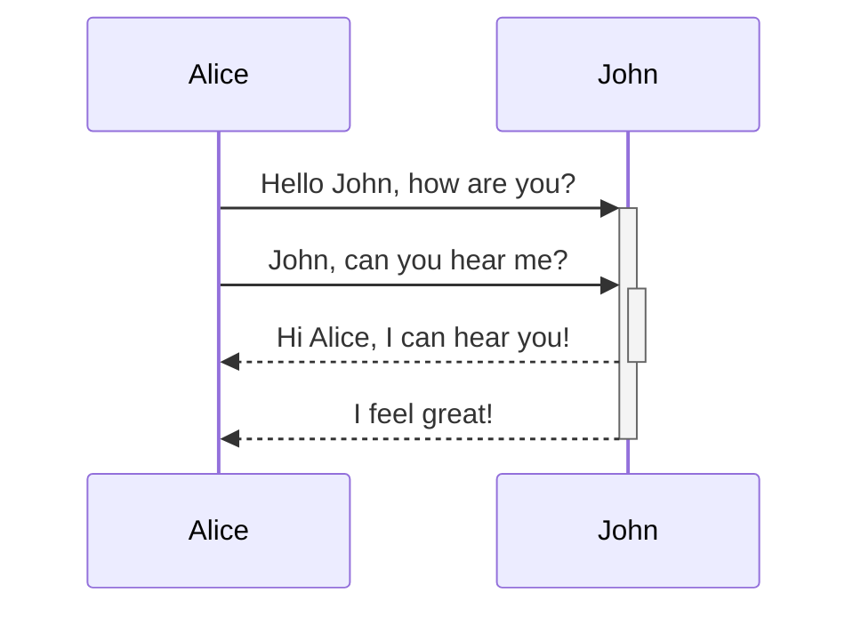

# Introduction
- mentionner différentes architectures : 
  - téléphone → serveur
  - navigateur -> serveur
  - application PC → base de données
  
# HTTP
- mentionner cookies, voir livre

```mermaid
sequenceDiagram
    Alice->>+John: Hello John, how are you?
    Alice->>+John: John, can you hear me?
    John-->>-Alice: Hi Alice, I can hear you!
    John-->>-Alice: I feel great!
```

    