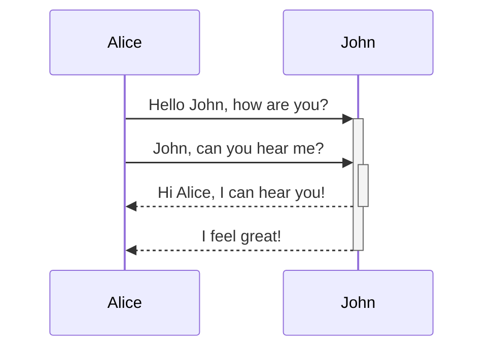

# Introduction
- mentionner différentes architectures : 
  - téléphone → serveur
  - navigateur -> serveur
  - application PC → base de données
- mentionner langages: Javascript / HTML client, Python, Java, PHP
  
# HTTP
- mentionner cookies, voir livre

    