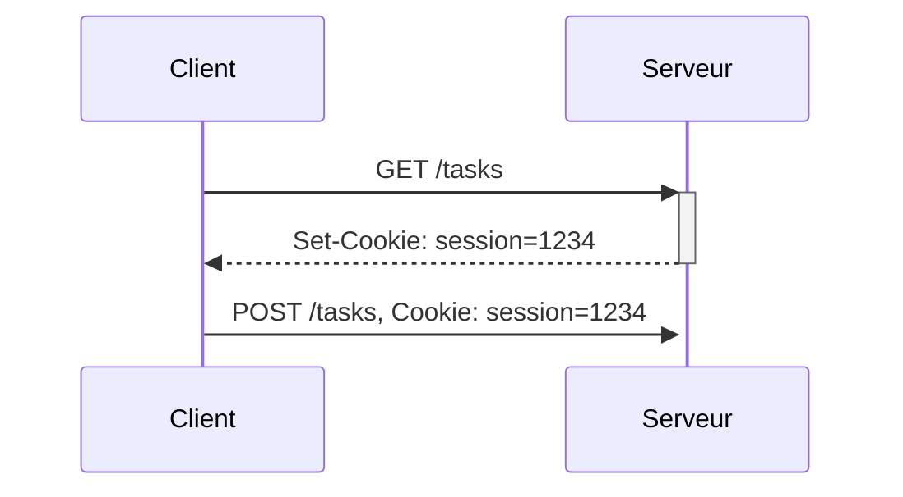

# TP: Application TO DO list

Nous allons créer une application client/serveur permettant de gérer une liste de tâches.

Dans notre TP, le client et le serveur seront tous les deux sur votre ordinateur.
- Le client sera un navigateur web
- Le serveur sera un programme Python utilisant le *framework* [**Flask**](https://flask.palletsprojects.com/en/2.3.x/)
  - un framework est un ensemble de composants logiciels qui sert à créer les fondations d'un autre logiciel
- Le client communiquera avec le serveur en utilisant le protocole HTTP.
   
  
## Créer un serveur web minimal
1. créer un dossier `todo_server` sur votre bureau
2. ouvrir l'éditeur Python et copier/coller le code suivant dans un fichier `todo.py`:
```python
from flask import Flask # 1


def hello(): # 2
    return "Hello World!"


def init():
    app = Flask(__name__) # 3
    app.add_url_rule('/hello', view_func=hello) # 4
    app.run(debug=True) # 5    

if __name__ == '__main__':
    init()
```
3. Lancer le programme
4. ouvrir un navigateur et appeler l'URL http://127.0.0.1:5000/hello


### Analyse du code
1. importe l'objet `Flask` dans le module `flask`
2. la fonction `hello()` sera appelée lorsque le serveur recevra une requête HTTP
3. crée un objet `app` qui permet de paramétrer l'application Flask
4. Nous ajoutons une règle d'URL: lorsque le chemin demandé est `/hello`, Flask saura qu'il doit appeler la fonction `hello`.
5. Démarre l'application Flask, en mode debug. 
   Le mode debug permet entre autre de recharger automatiquement les fichiers `.py` lorsque nous les modifions.

### Exercices
- regardez l'adresse IP de votre voisin, et connectez-vous à son serveur. Sous Windows, utilisez la commande `ipconfig`
- dans le navigateur, ouvrir les outils développeur (`ctrl-shift-I`), onglet "Network". 
  Observez les requêtes HTTP. Essayez d'autres URL. Quels sont les codes de retour du serveur ? 

## Afficher la liste de taches
Pour notre application TO DO List, nous allons coder une première fonction qui va renvoyer une page HTML avec une liste de tâches.

1. Ajouter le code suivant au fichier `todo.py`:
```python
tasks = [ # 1
    {'title': 'préparer le TP client/serveur', 'done': True},
    {'title': 'commander le robinet', 'done': False},
    {'title': 'faire les courses', 'done': False},
]


def get_tasks():
    html = '<!DOCTYPE html>\n' # 2
           '<html><body>\n'
           '<h1>TO DO list</h1>\n'
           '<table>\n'

    for task in tasks: # 3
        title = task['title']
        style = ''
        task_html = f'<div style="{style}"> - {title}</div>' # 4
        html += '    <tr><td>' + task_html + '</td></tr>\n'
    html += '</table> \n'
            '</body></html>'
    return html # 5
```

2. Modifier la fonction `init()`:
```python
def init():
    app = Flask(__name__)
    app.add_url_rule('/hello', view_func=hello)
    app.add_url_rule('/tasks', view_func=get_tasks) # 6
    app.run(debug=True)
```

3. Sauvegarder. Le mode debug devrait recharger le nouveau code
4. Ouvrir l'URL http://127.0.0.1:5000/tasks

### Analyse du code
1. Déclare une variable globale `tasks` qui contient la liste des tâches à afficher.
2. Déclare une variable `html` avec l'en-tête HTML, contenant un tableau.
3. pour chaque tâche, ajoute des lignes de tableau avec les balises `<tr><td>` 
4. utilise une `f-string` pour le code HTML propre à chaque tâche. 
   Cette fonctionnalité de Python permet d'utiliser des variables `{ma_variable}` à l'intérieur d'une chaîne de caractères.
5. la fonction renvoie le code HTML à renvoyer au navigateur
5. nous ajoutons une `url_rule` pour pouvoir appeler notre fonction

### Exercices
1. Dans le navigateur, observez le code HTML généré.
2. Ajoutez une condition pour changer le `style` si la tâche a la valeur `done=True`.
3. Modifiez la variable `tasks` pour ajouter une tâche.

## Utiliser un template
Renvoyer du code HTML directement dans une fonction Python est une mauvaise pratique.
Il est préférable de séparer le code HTML et le code Python. 
Cela permet d'identifier clairement le code d'affichage (view) et le code de traitement (controller).

Par ailleurs, certains développeurs sont plus spécialisés dans les interfaces graphiques (développeurs "Front-end"), 
et d'autres dans la partie serveur (développeurs "Back-End"). 
Ils peuvent ainsi intervenir en parallèle sur différents aspects du logiciel sans se gêner.

Nous allons déplacer le code HTML pour le mettre dans un template [Jinja](https://flask.palletsprojects.com/en/2.3.x/templating/).

1. Créer un dossier `templates`, pui créer un fichier `tasks.html` dans ce nouvrau dossier. 
2. copier/coller le code suivant dans `tasks.html`:
```html 
<!DOCTYPE html>
<html>
<head title="TO DO list"></head>
<body>
<h1>TO DO list</h1>
<table>
    
        
            
        
    <tr>
        <td>
            <div style="color: {{color}}">- {{task['title']}}</div>
        </td>
    </tr>
    
</table>
</body>
</html>
```
2. Modifier le code de la fonction `get_tasks()`:
```python
def get_tasks():
    return render_template('tasks.html', tasks=tasks)
```
3. Rafraîchir la page dans le navigateur
 
### Exercices
1. Observez le code HTML généré
1. Comment sont déclarées les boucles en Jinja?
2. Comment sont déclarées les instructions conditionelles ?
3. Quelle est la signification de la syntaxe `{{ ma_variable }}` ?

## Créer une nouvelle tâche
Nous allons maintenant ajouter un **formulaire** à notre page, afin de pouvoir créer des nouvelles tâches.
1. Ajouter le code HTML suivant avant la balise `</table>`:
```html
<form action="/tasks" method="POST"><!-- 1 -->
    <label>New task: </label><input type="text" name="title"/><!-- 2 -->
    <input type="submit" value="Create"><!-- 3 -->
</form>
```
2. Ajouter la fonction python suivante, qui sera appelée lorsque nous appuierons sur le bouton *Create*:
```python
def create_task():
    result = request.form # 4
    title = result['title'] # 5
    tasks.append({'title': title, 'done': False}) # 6
    return get_tasks() # 7
```
3. Modifier la fonction `init()`:
```python 
def init():
    app = Flask(__name__)
    app.add_url_rule('/tasks', view_func=get_tasks)
    app.add_url_rule('/tasks', view_func=create_task, methods=["POST"]) # 8
    app.run(debug=True)
```
4. Rafraîchir la page dans le navigateur

 
### Analyse du code
1. Déclare un formulaire HTML. La `method` `POST` sera utilisée dans la requête HTTP. 
   Elle indique par convention que l'opération effectue des modifications. 
   L' `action` contient l'URL à appeler lorsque le formulaire est envoyé (submit). 
2. Balise texte
3. Bouton create
4. `result` contient les données du formulaire
5. La variable `title` contient la valeur du champ (input) ayant le nom `title`
6. Ajoute la nouvelle tâche à la variable globale
7. Appelle `get_tasks()` pour renvoyer à nouveau la page HTML au navigateur 

### Exercices
1. Ouvrir l'onglet Network dans Firefox, ajouter de nouvelles tâches. Observez les requêtes HTTP.
2. Rafraîchir la page. Que se passe-t-il ? A votre avis pourquoi?
3. Utiliser la méthode `GET` dans le formulaire. Recommencer les points 1. et 2. Qu'observez-vous?
   Est-il judicieux d'utiliser la méthode `GET` dans notre cas?
 
Pour aller plus loin :
1. Afin d'éviter le message du navigateur après un refresh, utiliser une redirection. Voir [refirects and errors](https://flask.palletsprojects.com/en/3.0.x/quickstart/#redirects-and-errors)

## Modifier une tâche
Nous allons maintenant ajouter une "checkbox" à côté de chaque tâche afin de pouvoir indiquer qu'elle est terminée (`done=True`).
Pour cela, nous devons ajouter un "mini" formulaire pour chaque tâche.
1. Modifier le code HTML entre les deux balises `<tr>` et `</tr>`:
```html
    <tr>
        <form action="/tasks4/{{loop.index}}" method="POST">
            <td>
                <input type="checkbox" name="done" {{ checked }} />
            </td>
            <td>
                <div style="color: {{color}}">- {{task['title']}}</div>
            </td>
            <td><input type="submit" value="save"/></td>
        </form>
    </tr>
```
2. Ajouter la fonction Python suivante:
```python
def update_task(id):
    form = request.form
    i = int(id) - 1
    task = tasks[i]
    if form.get('done'):
        task['done'] = True
    else:
        task['done'] = False

    return get_tasks()
```
3. Modifier la fonction `init()` pour ajouter la nouvelle url:
```python    
def init():
    ...
    app.add_url_rule('/tasks/<id>', view_func=update_task, methods=["POST"])
    ...
```
4. Rafraîchir la page

### Exercices
1. Modifier les tâches avec la checkbox
2. Il n'est pas très pratique de devoir cliquer sur le bouton *save*. 
   Supprimez-le et ajouter un "event handler" sur la checkbox: `onclick="submit()"`
3. Observez l'URL après avoir modifié une tâche. Rafraîchir la page. Que se passe-t-il? Est-ce satisfaisant?

Pour aller plus loin :
1. Ajouter un bouton "Delete" sur chaque tâche
2. Ajouter un bouton "delete all done", qui supprime toutes les tâches avec `done=True`
3. Utiliser une redirection pour éviter le problème d'URL et de rafraîchissement.

## Gestion des sessions 
Notre application commence à avoir une utilité pour gérer une liste de tâches.
Cependant, si deux utilisateurs se connectent à notre serveur, ils verront tous les deux les mêmes tâches.
Il faudrait pouvoir avoir une liste de tâches propre à chaque utilisateur.

Pour cela, nous allons utiliser le concept de "session". Le procédé est le suivant :

1. Le serveur demande au client de stocker un Cookie
2. Toutes les requêtes faites au serveur envoient le cookie. Cela permet au serveur d'identifier le client.


Nous allons conserver une liste de tâche pour chaque utilisateur en utilisant la bibliothèque [flask_session](https://flask-session.readthedocs.io/en/latest/introduction.html).
1. Ajouter le code suivant:
```python
from flask_session import Session

def read_session_tasks():
    if 'tasks' in session:
        return session['tasks']
    else:
        tasks = []
        session['tasks'] = tasks
        return tasks


def write_session_tasks(tasks):
    session['tasks'] = tasks
```
2. Modifier la fonction `init()`:
```python
def init():
    app = Flask(__name__)
    app.config['SESSION_TYPE'] = 'filesystem'
    app.secret_key = 'supersecretkey'
    Session(app)
    ...
```
3. Supprimer la déclaration `tasks`
4. Partout où la variable `tasks` est utilisée, appeler la fonction `read_session_tasks` pour lire, 
   ou la fonction `read_session_tasks()` pour modifier.
3. Rafraîchir la page

### Exercices
1. Observer les headers HTTP `Cookie` et `Set-Cookie`
2. Créer de nouvelles tâches. Fermer/Ouvrir le navigateur, rafraîchir la page
3. Supprimer le cookie de session dans le navigateur. Rafraîchir la page
4. Demander à son voisin d'utiliser son serveur
 
## Pour aller plus loin
1. Ajouter une fonction de recherche, qui filtrera les résultats. Utiliser la méthode `GET`
2. Effectuer la recherche du côté client, en utilisant Javascript
3. Créer une feuille CSS pour améliorer le look
4. Ajouter un attribut `category`, en utilisant une "drop-down" list.
5. Ajouter une fonction de tri
6. Effectuer le tri du côté client, en utilisant Javascript
